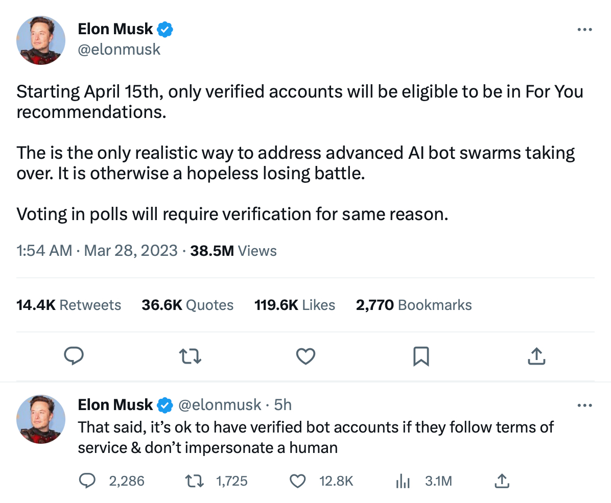

Twitter will make Twitter worse for non-paying and paying subscribers by restricting what non-paying subscribers can do. Any by removing the blue verified checkmark from celebrity accounts that don’t want to pay for Twitter Blue.[^@verified]

[^@verified]:
    > On April 1st, we will begin winding down our legacy verified program and removing legacy verified checkmarks. To keep your blue checkmark on Twitter, individuals can sign up for Twitter Blue here: https://twitter.com/i/twitter_blue_sign_up 
    > 
    > Organizations can sign up for Verified Organizations here: https://twitter.com/i/en/verifiedorganizations/apply
    
    [Tweet](https://twitter.com/verified/status/1639029459557679104) published March 23, 2023 by @Verified on twitter.com.

This morning at around 2am (my local time) Twitter’s CEO ~~tooted~~ tweeted his latest idea:[^@elonmusk]

[^@elonmusk]:
    > Starting April 15th, only verified accounts will be eligible to be in For You recommendations.
    > 
    > The is the only realistic way to address advanced AI bot swarms taking over. It is otherwise a hopeless losing battle.
    > 
    > Voting in polls will require verification for same reason.
    
    > That said, it’s ok to have verified bot accounts if they follow terms of service & don’t impersonate a human
    
    [Tweet one](https://twitter.com/elonmusk/status/164050269854907597) and [Tweet two](https://twitter.com/elonmusk/status/1640532921386663938) published March 28, 2023 by @elonmusk on twitter.com

(I took the liberty of spell-checking the quoted Tweet, the screenshot is unmodified.)

The man is hilarious. Does he even realize what he did there? Those few bucks won’t stop (generative) AI from spamming and voting—a few tweaks and the AI can just post product endorsements every other day to pay for the subscription and then some. We’ll probably see famous generative AI accounts soon, because they are bound to be awesomely good at writing popular tweets.

I suspect it’s all about getting more people to pay for Twitter Blue.