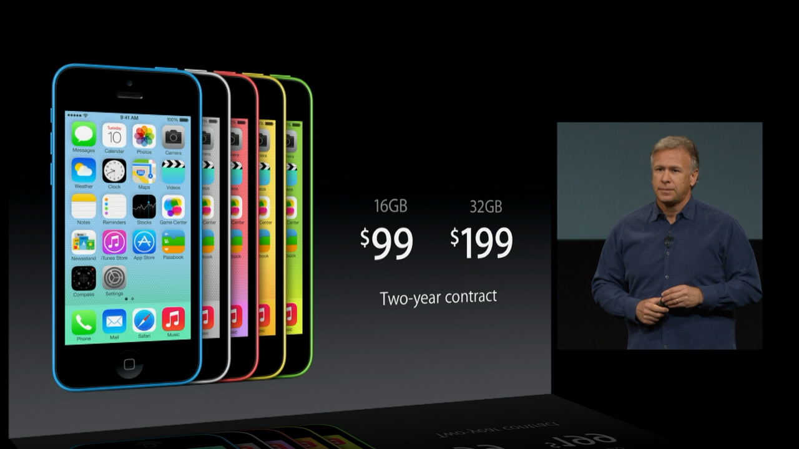
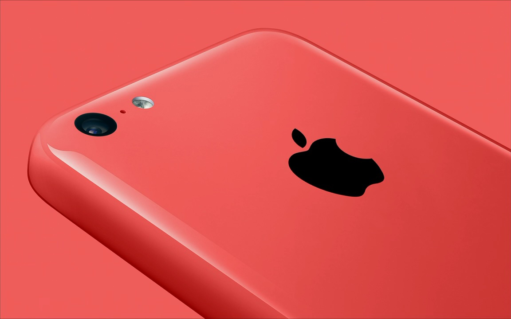
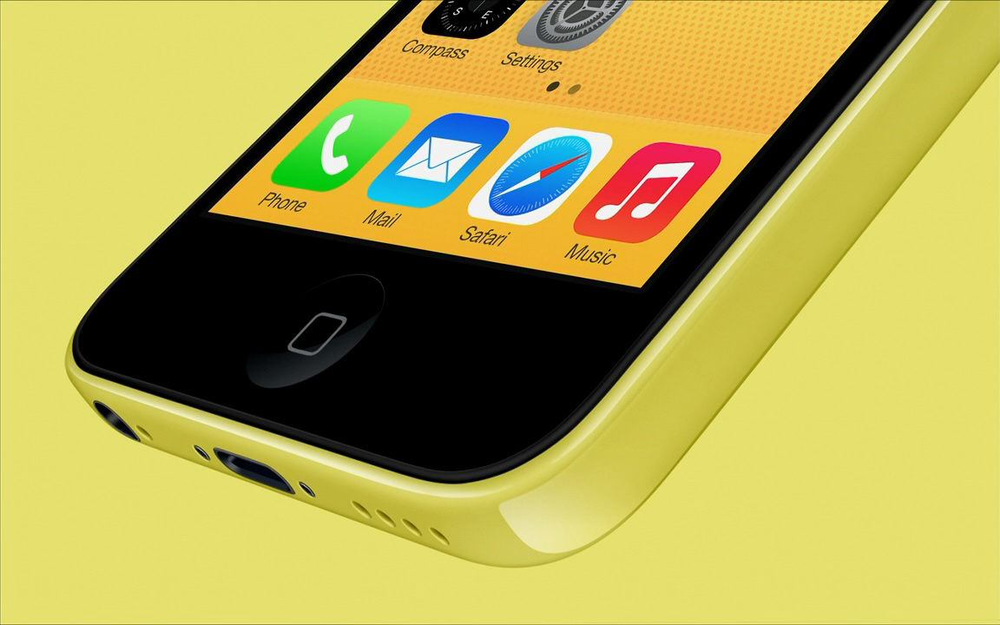
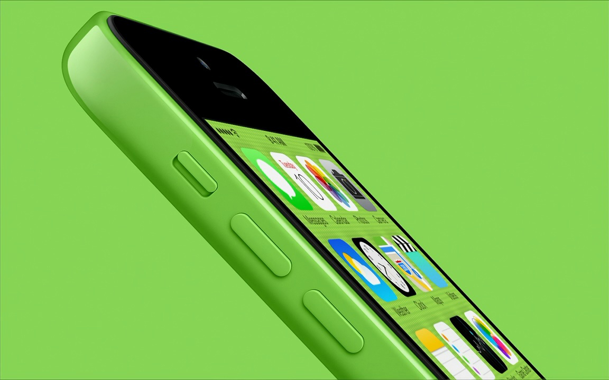
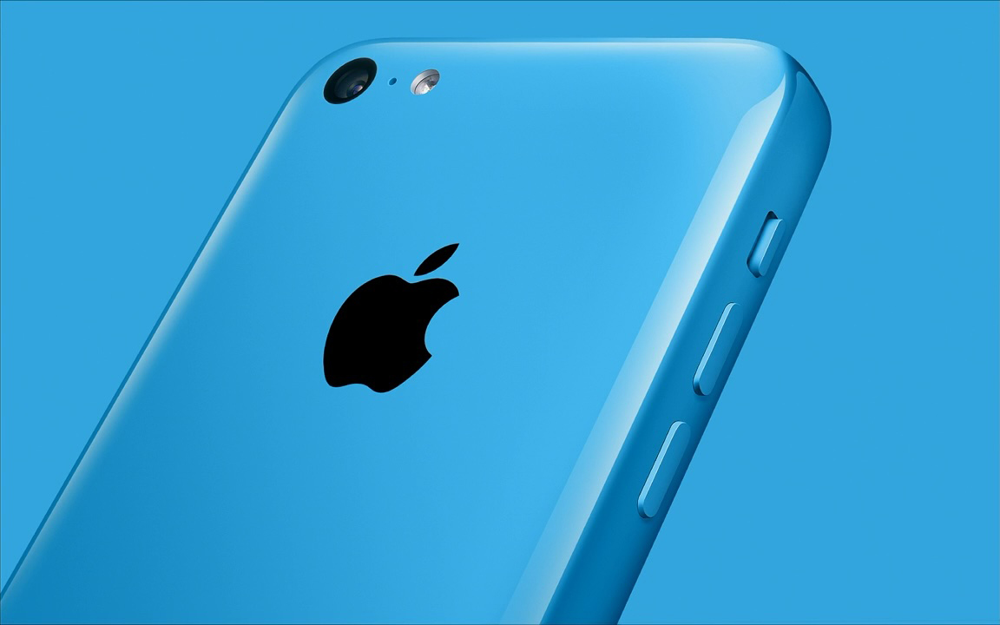
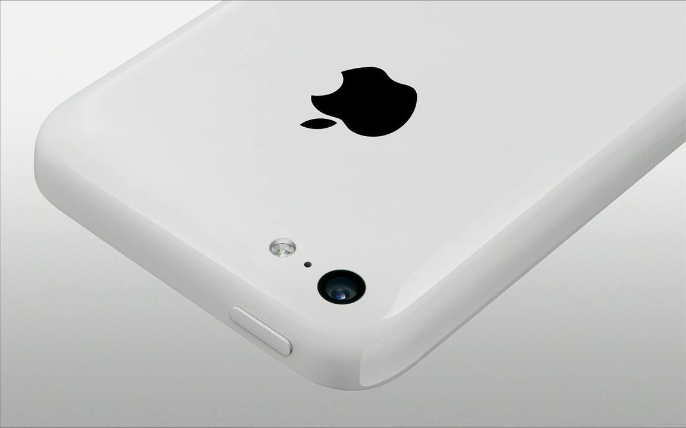
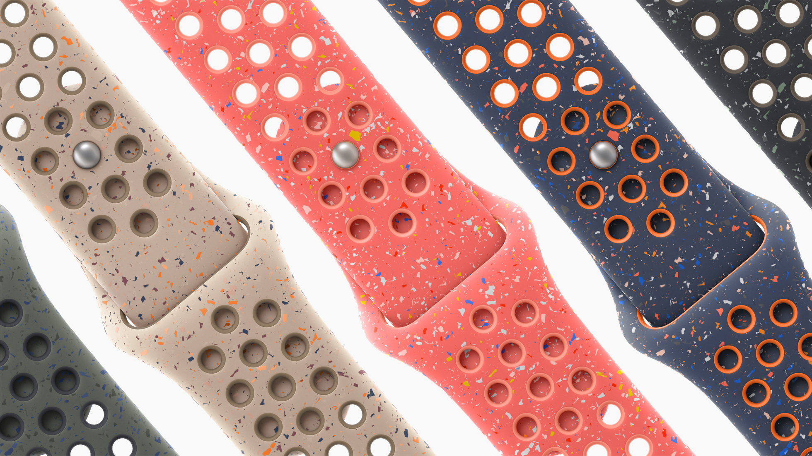

After the recent iPhone 15 announcement, I felt underwhelmed and disappointed. When Tim signed off at the end of the keynote, I didn’t want to buy the new iPhone, but wondered what had happened to Apple in recent years. This feeling of disappointment and my bored reaction to Apple’s new flagship products motivated me to ask myself the question: “What would have made me want to replace my iPhone 12 Pro?” And I found several answers I want to share in the form of a wishlist.

## A singlehanded-use friendly size

Remember when phones were small enough to be comfortably used with one hand? Like the iPhone 5/5s/5C at 124mm by 59mm, and even the iPhones 12/13 Mini at 132mm by 64mm are still ok to use most of the time. The iPhone 5 had a much smaller display than the 13 Mini, which meant the upper-edge of the display was further down and thus easier to reach while using only one hand. The 12/13 Minis have no “forehead”, putting the upper-edge of the display further up, just outside my comfort zone.

I can’t comfortably use any of the new phones Apple released in recent years with one hand, and I know I’m not alone. We’ve all just gotten used to the uncomfortable phones and most of us use them with two hands exclusively. I think its a valid choice that the “Plus” / “Max” sized phones are designed for two-handed use, but the normal one should be smaller than the iPhone Mini was. I own an iPad, my phone should be small!

The uncomfortable size is what kept me from buying a new phone first and foremost. A truly small phone without any of the other improvements on this wish list would be enough to make me want to replace my iPhone!

## Hide the camera bump with a thicker battery
The iPhone cameras are getting astonishingly good in recent years,[^iPhone15CameraReview] but new iPhones sport a camera-assembly that sticks out of the back like a sore thumb. The camera mountain causes the phone to be wobbly and annoying while placed on a flat surface, like a table. The iPhone camera mountain really bugs me and I’d have bought an iPhone that was a little thicker and heavier and was a little less capable as a camera, but featured a flat back with no hump.

[^iPhone15CameraReview]: [iPhone 15 Pro Max Camera Review: Depth and Reach](https://www.lux.camera/iphone-15-pro-max-review) published on lux.camera by Sebastiaan de With, October 4, 2023.

## A compact everyday camera
What makes a point-and-shoot camera great is that you just point it at the scene and the photo will be decent. Compact cameras produce photos that look similar to what you see with the naked eye, because the lens in those cameras is very similar to the naked eye — somewhere between 35mm and 70mm.

The iPhone’s main camera uses a 24mm lens, which is at the extreme end of what compact cameras use. A 24mm lens is effectively a fish-eye, and photos will look off, if not cheap, no matter the technical image quality.

I wish Apple changed the `1x` main camera to use a 36mm lens and 48MP. It would enable Apple to introduce computational lenses of 54mm and 72mm with 12MP and 24MP respectively. The perfect range for a compact consumer camera! Throw in the Ultra Wide as is, and we’re golden.

| Zoom level | Photography Mode | Focal Length, Aperture | Camera     |
| ---------: | :--------------- | :--------------------- | :--------- |
|     `0.5x` | Macro            | 13mm, ƒ/2.2            | Ultra Wide |
|     `0.5x` | Ultra Wide       | 13mm, ƒ/2.2            | Ultra Wide |
|     `1.0x` | Wide             | 36mm, ƒ/1.X            | Main       |
|     `1.5x` | Normal           | 54mm, ƒ/1.X            | Main       |
|     `2.0x` | Zoom             | 72mm, ƒ/1.X            | Main       |

I’d be very tempted to buy an iPhone Mini with this camera configuration — even with a hump.

## Delightful and colorful
I miss randomly noticing my iPhone in a positive way and thinking, "wow, this looks sexy!", or holding it in my hand absentmindedly and enjoying how it feels. Remember the round iPhone 3G or the iPhone 8? Those felt quite different to hold than the titanium iPhone 15 feels today, despite its softer edges compared to the non-Pro models.

Apple also used to dare making the iPhone delightful, not just flawless. And there is a big difference between a flawless object and a delightful one! The iPhone was colorful or truly black or white. Just look at the gorgeous iPhone 5C, the glossy, seamless plastic with generously rounded edges and delightful colors. In comparison, modern iPhones feel cold — metallic — and their colors stark.

The iPhone 5C was a looker and felt great to touch, and it still has its fans! Just a few days ago BasicAppleGuy wrote, <q cite="https://mastodon.social/@BasicAppleGuy/111237018172895938">Never had or handled an iPhone 5c until today... These phones are drop dead gorgeous and feel fantastic in the hand.</q> [on Mastodon.](https://mastodon.social/@BasicAppleGuy/111237018172895938)

If Apple dared to make a glossy plastic phone again, I’d want to buy one immediately! Yes, recycled plastic, I’m not kidding. Imagine a new lineup of iPhones inspired by the iPhone 5C and maybe this year’s watch bands. Some with bolder colors, one just looking like a cappuccino, “so good you'll want to lick [them],”[^jobsQuote] inspired by the Desert Stone Nike Sport Band (the second from the left in the image below). And one looking like a starry night, inspired by the Blue Flame band — second from the right.

[^jobsQuote]:
	Alluding to a quote from Steve Jobs.	He described the Aqua buttons in MacOS X with the words: <figure><q>We made the buttons on the screen look so good you’ll want to lick them.</q>
	<figcaption><cite>On Mac OS X's Aqua user interface, as quoted in Fortune magazine (24 January 2000) - 2000-04</cite></figcaption></figure>

## Plastic should be a fashion choice!
Without going too deep, lets remember that plastics, once produced, don’t decompose. Neither disposing of it into landfill, nor incineration are sustainable solutions.[^plasticDisposal] We should re-use plastics as much as we can — we created the plastic problem by making it, not by using it. You could even argue we are making the problem worse by not re-using plastics that already exist, because that declares plastic as waste, when it should have been used as a resource.

[^plasticDisposal]: Producing plastic uses energy and releases CO2 and toxins into the atmosphere. Disposing of it uses energy and releases CO2 and toxins into the atmosphere. Neither is good, but once produced the only responsible thing is to keep re-using (recycling) it and preventing it from polluting the environment. And we’re not doing that: According to [OurworldInData.org](https://ourworldindata.org/plastic-pollution?cmdf=global+rate+of+plastic+incineration#how-do-we-dispose-of-our-plastic) in 2019 about 50% of global plastic disposal went into landfill, 19% were incinerated, 9% recycled. A whopping 22% were mismanaged and 0.3% littered.

How can Apple help with this problem? By making recycled plastic fashionable! Imagine the iPhone’s back was made from 100% recycled plastic coming from single-use items and the oceans — or older iPhones. Apple would utilize the iPhone production to capture plastic into a circular ecosystem, where they’d re-use it to make new phones, Macs, iPads, Visions, Watches, you name it!

A recycled plastic back inspired by the wonderful iPhone 5C and the 2023 Watch Bands could become a fashion statement for environmental protection. It would look great without needing a case, aging gracefully, showing its battle scars from inside our pockets, purses, and the concrete floor it was dropped on. This material choice could make the phone a net negative polluter. It would also be cheaper to produce and nicer to hold than glass and metal phones. **It would be a refreshing change of pace to see Apple use its power as a trend setter to define recycled plastic as a classy and fashionable material!**

## Is any of this even remotely realistic?
I have no idea if any of this is realistic. If you’d like to bring this wishlist to Apple’s attention, you could send it to Tim and let him know which of these points would make you buy a new iPhone: [tcook@apple.com](mailto:tcook@apple.com) We know he reads customer emails and often forwards them internally.